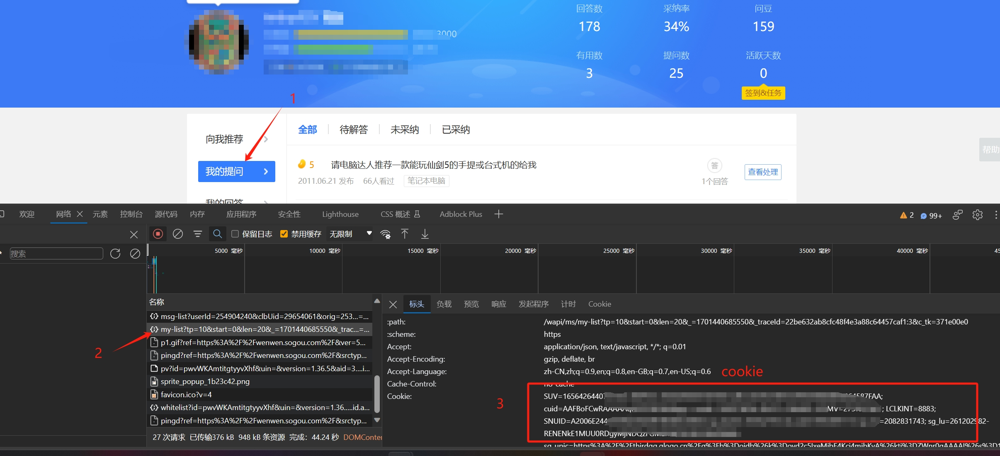
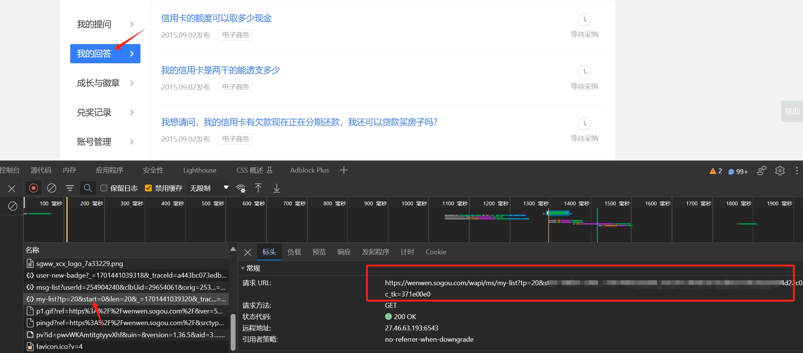

一个可以批量爬取你个人账号的搜狗问问-我的提问/我的回答，下载并转换为.md格式的python脚本。

（一个关于你青春黑历史的备份）

特点：

1、可识别 `wenwen.sogou.com/question/XXX`的内容

2、可抓取提问、回答的图片，并将官网屏蔽不显示的图片展示出来（详见 `sougouwenwen_fetch_tool`的 `wapm-注释`）

注：
1、本项目仅用于个人搜狗问问的个人提问、回答内容的备份

使用：

1. 将`configBAK.json`修改为`script/config.json`

2. 登陆[搜狗问问](https://wenwen.sogou.com/)-打开”我的提问“，按下F12按键，打开开发者模式。

3. 选择“my-list?my-list?**tp=10**"开头的网页，复制标头中的请求URL()、Cookie，分别填入到`script/config.json`文件当中的"questionUrl"、"Cookie"当中，并将”我的提问“的总页数填入到"questionPageNum"“字段当中

   

   

4. 打开”我的回答“，按下F12按键，打开开发者模式。选择“my-list?my-list?**tp=20**"开头的网页，复制标头中的请求URL()、填入到`script/config.json`文件当中的"answerUrl"当中（Cookie可以用“我的提问”的），并将”我的回答“的总页数填入到"answerPageNum"字段当中

5. 修改`script/config.json`的"nickname"（配合vuepress使用，对应frontmatter的`category:$nickname`

6. 在项目当前目录运行 `py ./script/sougouwenwen_fetch_tool.py`即可将结果下载并处理为.md格式，并保存到 `ouput`文件夹
   注意：将会生成2个list.md、2个merge.md文件，分别对应提问/回答列表及各个页面的详细内容。

可选功能：

1. vuepress模板：

   可以修改`./template`目录下的2个模板的frontmatter（配合vuepress使用，可将处理后的.md作为vuepress的页面展示）
   运行 `py ADDfrontmatter.py`，即可将添加好frontmatter内容的文件添加到 `Download2`文件夹

2. 下载markdown文件内所有 ``的图片
   运行 `PY mdPicDownload.py`，即可批量下载2个merge.md的图片到 `PicDownload`文件夹。（可在 `mdPicDownload.py`内修改需要读取的markdown文件路径，默认为读取/output/mergeXXX.md。
